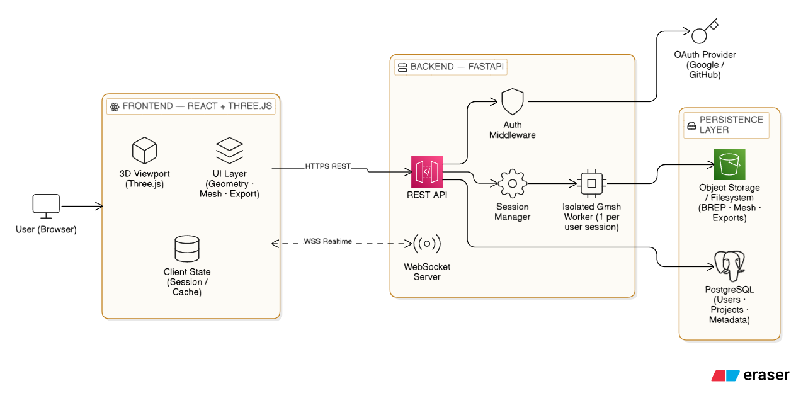
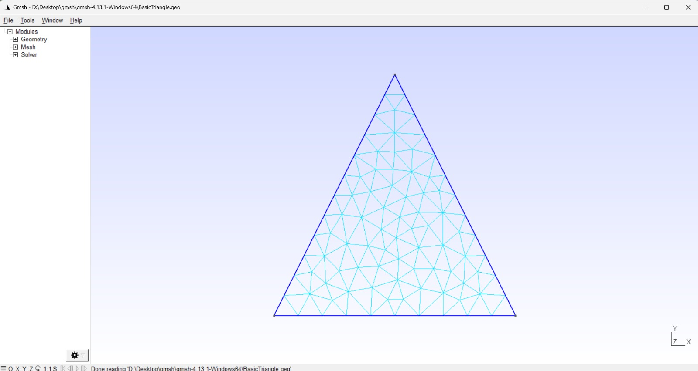
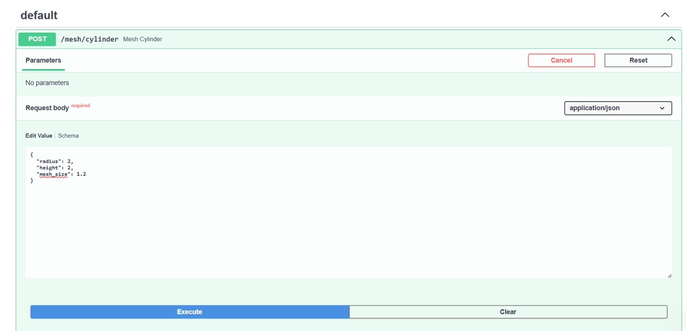

# Software Requirements Specification — WebMsh

**Version:** 1.0
**Date:** March 1, 2026
**Project:** WebMsh — A Web-Based Mesh Generation Platform

---

## Table of Contents

1. [Introduction](#1-introduction)
   - 1.1 [Purpose](#11-purpose)
   - 1.2 [Intended Use and Target Audience](#12-intended-use-and-target-audience)
   - 1.3 [Product Scope](#13-product-scope)
   - 1.4 [Definitions](#14-definitions)
2. [General Description](#2-general-description)
   - 2.1 [Business Requirements](#21-business-requirements)
   - 2.2 [User Needs](#22-user-needs)
   - 2.3 [Product Limitations and Constraints](#23-product-limitations-and-constraints)
   - 2.4 [Assumptions and Dependencies](#24-assumptions-and-dependencies)
3. [Features and Requirements](#3-features-and-requirements)
   - 3.1 [Features](#31-features)
   - 3.2 [Functional Requirements](#32-functional-requirements)
   - 3.3 [External Interface Requirements](#33-external-interface-requirements)
   - 3.4 [Non-Functional Requirements](#34-non-functional-requirements)

---

## 1. Introduction

### 1.1 Purpose

This document specifies the software requirements for **WebMsh**, a web-based mesh generation platform built on top of the Gmsh Python API. It is intended to serve as the authoritative reference for the system's scope, features, constraints, and acceptance criteria throughout design, development, and testing.

### 1.2 Intended Use and Target Audience

**Intended use:** WebMsh provides browser-based access to CAD geometry creation, manipulation, and finite element mesh generation — capabilities traditionally available only through desktop applications. Users interact with a 3D viewer and sidebar UI to build geometry, assign physical groups, generate meshes, and export results in standard simulation formats.

**Target audience:**

| # | Audience | Description |
|---|---|---|
| 1 | **Engineering students** | Learning FEA/CFD workflows; need accessible meshing without installing native software. |
| 2 | **Academic researchers** | Preparing meshes for simulation codes (FEniCS, OpenFOAM, Code_Aster, Elmer). |
| 3 | **Mechanical / Civil / Aerospace engineers** | Building and meshing simple-to-moderate geometry for structural or thermal analysis. |
| 4 | **CFD practitioners** | Generating surface and volume meshes for fluid simulation. |
| 5 | **3D printing users** | Creating or importing geometry and exporting watertight STL meshes. |

### 1.3 Product Scope

WebMsh is a **server-side Gmsh instance with a web frontend**. The Python backend (FastAPI) runs the Gmsh API and exposes it via REST and WebSocket endpoints. The frontend (React + Three.js) provides a 3D viewer and interactive UI.

**In scope (V1):**

- User authentication and project management
- Geometry creation: 5 OCC primitives, extrude, revolve
- Boolean operations: union, cut, intersect
- Geometry transforms: translate, rotate, scale, copy, delete
- STEP and STL file import
- Mesh generation: 1D, 2D, 3D with global size control and algorithm selection
- Physical group creation and assignment via click-to-select
- Mesh export in 6 formats (.msh, .stl, .vtk, .step, .inp, .unv)
- Interactive 3D viewer with selection, highlighting, clipping, and wireframe toggle
- Undo/redo
- Auto-save and manual save

<!-- **Out of scope (V1):**

- 2D sketch/constraint mode
- Boundary layer meshing
- Mesh size fields and local refinement
- Parametric models with variable-driven sliders
- In-browser Python/GEO script editor
- Real-time multi-user collaboration
- Solver integration and post-processing
- Mobile-optimized layout -->

### 1.4 Definitions

| Term | Definition |
|---|---|
| **Gmsh** | An open-source 3D finite element mesh generator with a built-in CAD engine (OpenCASCADE) and post-processor. |
| **OCC** | OpenCASCADE Technology — the open-source CAD kernel used by Gmsh for geometry operations. |
| **BREP** | Boundary Representation — a method of representing shapes using boundaries (vertices, edges, faces). Used internally by Gmsh/OCC. |
| **Physical group** | A named collection of geometric entities (points, curves, surfaces, volumes) used to assign boundary conditions and material regions for simulation. |
| **Mesh** | A discretization of continuous geometry into a finite number of elements (triangles, tetrahedra, quads, hexahedra, etc.) used for numerical simulation. |
| **STEP** | Standard for the Exchange of Product Data (ISO 10303) — the most widely used CAD file exchange format. |
| **STL** | Stereolithography file format — a surface mesh format using triangular facets, common in 3D printing. |
| **Entity** | A geometric object in Gmsh identified by a dimension (0=point, 1=curve, 2=surface, 3=volume) and a tag (integer ID). |
| **Raycasting** | A technique for determining which 3D object in a scene is under the user's mouse cursor by casting a ray from the camera through the click position. |
| **JWT** | JSON Web Token — a compact, URL-safe token format used for authentication. |
| **OAuth** | An open standard for access delegation, used here for third-party sign-in (e.g., Google, GitHub). |
| **WebSocket** | A persistent, bidirectional communication protocol between client and server, used for real-time updates. |

---

## 2. General Description

### 2.1 Business Requirements

| # | Requirement |
|---|---|
| 1 | The product shall be accessible via any modern web browser (Chrome, Firefox, Edge, Safari) without requiring software installation. |
| 2 | The product shall provide core Gmsh meshing functionality — geometry creation, boolean operations, mesh generation, physical group assignment, and multi-format export — through a graphical web interface. |
| 3 | The product shall support persistent user accounts and saved projects, allowing users to return to work across sessions. |
| 4 | The product shall be deployable as a containerized application (Docker) on standard cloud infrastructure. |

### 2.2 User Needs

| # | User Need | Priority |
|---|---|---|
| 1 | Users need to create geometry from primitives and combine them with boolean operations without writing code. | High |
| 2 | Users need to import existing CAD files (STEP, STL) from other tools. | High |
| 3 | Users need to generate finite element meshes with control over element size and algorithm. | High |
| 4 | Users need to define physical groups (boundary condition regions) by visually selecting geometry entities. | High |
| 5 | Users need to export meshes in formats compatible with their simulation solver. | High |
| 6 | Users need to visually inspect geometry and meshes in an interactive 3D viewer. | High |
| 7 | Users need their work to be saved automatically and retrievable across sessions. | High |
| 8 | Users need to undo mistakes without starting over. | Medium |
| 9 | Users need to slice through complex geometry to see internal structure. | Medium |
| 10 | Users need to understand what entities exist in their model via a structured tree view. | Medium |

### 2.3 Product Limitations and Constraints

| # | Limitation | Detail |
|---|---|---|
| 1 | **Gmsh is not thread-safe.** | Each user session requires a dedicated server-side Gmsh process. Concurrent user capacity is bounded by server memory and CPU. |
| 2 | **Large mesh transfer overhead.** | Meshes with millions of elements produce large data payloads. Transfer to the browser is bounded by network bandwidth, and rendering is bounded by GPU memory. |
| 3 | **Browser memory limits.** | Browsers typically cap memory at 2–4 GB per tab. Very large models/meshes may exceed client-side capacity. |
| 4 | **No offline mode.** | All geometry and meshing operations require communication with the server. The application is non-functional without network connectivity. |
| 5 | **Single-user sessions.** | V1 does not support real-time collaboration. Each project is edited by one user at a time. |
| 6 | **Desktop-only UI.** | The interface is designed for desktop screen sizes (≥1280px width). Tablets and phones are not supported in V1. |
| 7 | **Boolean operation fragility.** | OpenCASCADE boolean operations can fail on certain geometry configurations (e.g., tangent faces, degenerate edges). Error messages will be surfaced but not all failures can be prevented. |

### 2.4 Assumptions and Dependencies

| # | Assumption / Dependency |
|---|---|
| 1 | **Gmsh Python package** (`pip install gmsh`) is available and functional on the deployment platform (Linux x86_64). |
| 2 | **Python 3.10+** is available on the server. |
| 3 | **OpenCASCADE** is bundled with the Gmsh package (this is the default for the PyPI distribution). |
| 4 | Users have a modern browser with **WebGL 2.0** support (Chrome 56+, Firefox 51+, Edge 79+, Safari 15+). |
| 5 | Users authenticate via a third-party OAuth provider (Google or GitHub). The OAuth provider's API is assumed to be available. |
| 6 | A **PostgreSQL** (or SQLite for development) database is available for user accounts and project metadata. |
| 7 | Server deployment infrastructure supports **Docker** and provides at least 2 GB RAM per concurrent user session. |
| 8 | Project geometry state can be reliably serialized to and deserialized from BREP format + JSON metadata. |

---

## 3. Features and Requirements

### 3.1 Features

#### 3.1.1 Authentication and User Management

| # | Feature |
|---|---|
| 1 | OAuth sign-in via Google or GitHub. |
| 2 | JWT-based session tokens with expiration and refresh. |
| 3 | Sign-out and session invalidation. |
| 4 | User profile display (name, avatar from OAuth provider). |

#### 3.1.2 Project Management

| # | Feature |
|---|---|
| 1 | Create a new project with a name. |
| 2 | List all projects for the authenticated user (name, last modified date, thumbnail). |
| 3 | Open an existing project and restore its full geometry/mesh state. |
| 4 | Rename a project. |
| 5 | Delete a project. |
<!-- | 6 | Auto-save project state every 30 seconds when changes are detected. | -->
| 6 | Manual save via Ctrl+S or toolbar button. |

#### 3.1.3 Geometry Creation

| # | Feature | Gmsh API |
|---|---|---|
| 1 | Create a Box (origin, dx, dy, dz). | `occ.addBox()` |
| 2 | Create a Sphere (center, radius). | `occ.addSphere()` |
| 3 | Create a Cylinder (center, axis, radius, length). | `occ.addCylinder()` |
| 4 | Create a Cone (center, axis, r1, r2, length). | `occ.addCone()` |
| 5 | Create a Torus (center, r1, r2). | `occ.addTorus()` |
| 6 | Extrude a surface along a direction vector. | `occ.extrude()` |
| 7 | Revolve a surface around an axis by a specified angle. | `occ.revolve()` |

#### 3.1.4 Boolean Operations

| # | Feature | Gmsh API |
|---|---|---|
| 1 | Union (fuse) two or more volumes. | `occ.fuse()` |
| 2 | Cut (subtract) one volume from another. | `occ.cut()` |
| 3 | Intersect two or more volumes. | `occ.intersect()` |

#### 3.1.5 Geometry Transforms

| # | Feature | Gmsh API |
|---|---|---|
| 1 | Translate entities by a vector (dx, dy, dz). | `occ.translate()` |
| 2 | Rotate entities around an axis by an angle. | `occ.rotate()` |
| 3 | Scale entities from a center point by a factor. | `occ.dilate()` |
| 4 | Copy entities. | `occ.copy()` |
| 5 | Delete selected entities. | `occ.remove()` |

#### 3.1.6 Geometry Import

| # | Feature |
|---|---|
| 1 | Upload and import STEP files (.step, .stp) via file picker or drag-and-drop. |
| 2 | Upload and import STL files (.stl) via file picker or drag-and-drop. |

#### 3.1.7 Mesh Generation

| # | Feature |
|---|---|
| 1 | Generate 1D mesh (curve discretization). |
| 2 | Generate 2D surface mesh (triangles or quads). |
| 3 | Generate 3D volume mesh (tetrahedra). |
| 4 | Set global minimum and maximum mesh element size. |
| 5 | Select 2D meshing algorithm (MeshAdapt, Delaunay, Frontal-Delaunay, BAMG). |
| 6 | Select 3D meshing algorithm (Delaunay, Frontal, HXT). |
| 7 | Toggle recombine to quad elements (2D). |
| 8 | Toggle second-order elements. |
| 9 | Mesh refinement (uniform subdivision). |
| 10 | Mesh optimization (Netgen, Laplace smoothing). |
| 11 | Display mesh statistics: element count by type, node count, min/max element size. |

#### 3.1.8 Physical Groups

| # | Feature |
|---|---|
| 1 | Create a physical group for a given dimension (0D, 1D, 2D, 3D). |
| 2 | Assign a name to a physical group. |
| 3 | Add selected entities to a physical group via click-to-select in the 3D viewer. |
| 4 | Remove entities from a physical group. |
| 5 | Delete a physical group. |
| 6 | Color-code physical groups in the 3D viewer with distinct colors. |

#### 3.1.9 Export

| # | Feature | Format |
|---|---|---|
| 1 | Export mesh in Gmsh native format. | `.msh` |
| 2 | Export mesh as STL. | `.stl` |
| 3 | Export mesh in VTK format. | `.vtk` |
| 4 | Export geometry as STEP. | `.step` |
| 5 | Export mesh in Abaqus format. | `.inp` |
| 6 | Export mesh in Ideas/Universal format. | `.unv` |

#### 3.1.10 3D Viewer

| # | Feature |
|---|---|
| 1 | Orbit, pan, and zoom camera controls (mouse-driven). |
| 2 | Render geometry as shaded surfaces with visible edges. |
| 3 | Toggle mesh wireframe overlay. |
| 4 | Click-to-select entities (points, curves, surfaces, volumes). Selected entity is highlighted. |
| 5 | Hover-to-highlight entities under the cursor. |
| 6 | Transparency / X-ray mode toggle. |
| 7 | Single clipping plane with adjustable position and orientation. |
| 8 | Axis orientation gizmo (corner widget showing X/Y/Z directions). |
| 9 | Screenshot export (PNG download of current view). |
| 10 | Dark and light theme toggle. |

#### 3.1.11 Workflow and UX

| # | Feature |
|---|---|
| 1 | Model tree / entity browser sidebar showing all entities organized by dimension. |
| 2 | Entity property inspector: clicking an entity displays its bounding box, area or volume, and centroid. |
| 3 | Undo and redo via Ctrl+Z / Ctrl+Y or toolbar buttons. |
| 4 | Loading indicators during mesh generation and geometry operations. |
| 5 | Error notifications (toast messages) for failed operations with descriptive messages. |
| 6 | Keyboard shortcuts: Delete (remove entity), Ctrl+Z (undo), Ctrl+Y (redo), Escape (deselect). |

### 3.2 Functional Requirements

#### 3.2.1 Authentication

| # | Requirement |
|---|---|
| 1 | The system shall redirect unauthenticated users to the sign-in page. |
| 2 | The system shall authenticate users via OAuth 2.0 Authorization Code flow with a supported provider (Google or GitHub). |
| 3 | Upon successful OAuth callback, the system shall issue a JWT access token (1-hour expiry) and a refresh token (7-day expiry). |
| 4 | The system shall reject API requests with expired or invalid JWT tokens with HTTP 401. |
| 5 | The system shall store user records (OAuth provider ID, display name, email, avatar URL) in the database upon first sign-in. |

#### 3.2.2 Project Persistence

| # | Requirement |
|---|---|
| 1 | The system shall serialize project state as: (a) a BREP file containing all geometry, (b) a JSON file containing physical group definitions, mesh settings, and viewer state. |
| 2 | The system shall restore a project by loading the BREP file into Gmsh and applying the saved metadata. |
| 3 | Auto-save shall trigger 30 seconds after the last geometry or mesh modification, only if the state has changed since the last save. |
| 4 | The system shall store project files on the server filesystem, organized by user ID and project ID. |
| 5 | Deleting a project shall remove both the database record and all associated files from the filesystem. |

#### 3.2.3 Gmsh Session Management

| # | Requirement |
|---|---|
| 1 | The system shall allocate one Gmsh process per active user session. |
| 2 | Each Gmsh process shall be isolated: operations in one session shall not affect another. |
| 3 | The system shall terminate idle Gmsh processes after 30 minutes of inactivity. |
| 4 | The system shall limit the maximum number of concurrent Gmsh sessions based on server configuration (default: 20). |
| 5 | If maximum sessions are reached, new session requests shall receive HTTP 503 with a "server at capacity" message. |

#### 3.2.4 Geometry Operations

| # | Requirement |
|---|---|
| 1 | All geometry creation endpoints shall call `occ.synchronize()` after the operation and return the resulting entity dimension-tags. |
| 2 | All geometry creation endpoints shall return a triangulated surface representation (vertices + triangle indices + entity-to-triangle mapping) for rendering. |
| 3 | Boolean operations shall accept an array of "object" entities and an array of "tool" entities, and return the resulting entity dimension-tags. |
| 4 | If a geometry operation fails (e.g., boolean failure in OpenCASCADE), the system shall return HTTP 422 with a descriptive error message and leave the model state unchanged. |
| 5 | Transform operations shall accept an array of target entity dimension-tags and the transform parameters. |
| 6 | File import shall accept multipart file upload (max 50 MB), merge the file into the current model, and return the new entities. |

#### 3.2.5 Mesh Operations

| # | Requirement |
|---|---|
| 1 | Mesh generation shall accept dimension (1, 2, or 3) and apply the currently configured mesh settings before generating. |
| 2 | Mesh generation shall return mesh data as a binary buffer containing: node coordinates (Float64Array), element connectivity (Uint32Array), and element type codes. |
| 3 | Mesh statistics shall return: total node count, element count per type (triangles, quads, tetrahedra, hexahedra, etc.), minimum element size, maximum element size. |
| 4 | Mesh export shall write the file to a temporary location and return it as a downloadable binary stream with the appropriate Content-Disposition header. |
| 5 | If mesh generation fails, the system shall return HTTP 422 with the Gmsh error message. |

#### 3.2.6 Physical Groups

| # | Requirement |
|---|---|
| 1 | Physical groups shall be persisted as part of the project save state. |
| 2 | The system shall assign a unique color to each physical group automatically. Colors shall be distinct and visually differentiable (up to 12 groups; beyond 12, colors may repeat). |
| 3 | The system shall return entity-to-physical-group mappings so the frontend can apply per-face coloring. |

#### 3.2.7 Undo/Redo

| # | Requirement |
|---|---|
| 1 | The system shall maintain an operation stack per session, recording each geometry-modifying operation as a snapshot. |
| 2 | Undo shall restore the Gmsh model state to the snapshot before the most recent operation. |
| 3 | Redo shall restore the Gmsh model state to the snapshot after the most recently undone operation. |
| 4 | The operation stack shall hold a maximum of 50 snapshots. When exceeded, the oldest snapshot is discarded. |
| 5 | Performing a new operation after an undo shall discard the redo history. |

### 3.3 External Interface Requirements

#### 3.3.1 User Interface

| # | Requirement |
|---|---|
| 1 | The application shall present a single-page layout with: (a) a left sidebar for tools, forms, and the model tree; (b) a central 3D viewport; (c) a top toolbar for global actions (save, undo, redo, export, theme toggle). |
| 2 | The sidebar shall be collapsible to maximize viewport area. |
| 3 | Geometry creation forms shall validate input (e.g., radius > 0, dimensions > 0) and display inline validation errors before submission. |
| 4 | The 3D viewport shall occupy at least 60% of the screen width at all times. |
| 5 | The sign-in page shall display the application name, a brief description, and an OAuth sign-in button. |
| 6 | The project dashboard shall display projects as cards with name, last-modified timestamp, and a thumbnail preview. |

#### 3.3.2 Backend API

| # | Requirement |
|---|---|
| 1 | The backend shall expose a RESTful API over HTTPS on a configurable port (default: 8000). |
| 2 | All API endpoints (except `/auth/*`) shall require a valid JWT in the `Authorization: Bearer <token>` header. |
| 3 | The API shall return JSON for metadata responses and binary buffers for mesh/geometry data. |
| 4 | The API shall provide OpenAPI 3.0 documentation at `/docs` (auto-generated by FastAPI). |
| 5 | A WebSocket endpoint (`/ws/session/{session_id}`) shall be available for real-time progress updates during long-running operations (mesh generation). |

#### 3.3.3 External Systems

| # | Requirement |
|---|---|
| 1 | The system shall integrate with Google OAuth 2.0 or GitHub OAuth for user authentication. |
| 2 | The system shall use PostgreSQL (production) or SQLite (development) for persistent storage of user accounts and project metadata. |
| 3 | The system shall use the server filesystem for storing project geometry files (BREP) and exported meshes. |

### 3.4 Non-Functional Requirements

#### 3.4.1 Security

| # | Requirement |
|---|---|
| 1 | All client-server communication shall be encrypted via TLS (HTTPS / WSS). |
| 2 | JWT tokens shall be stored in HTTP-only, Secure, SameSite cookies — not localStorage. |
| 3 | File upload shall validate file extension and MIME type, and reject files exceeding the 50 MB size limit. |
| 4 | User-uploaded files shall be stored in sandboxed directories, isolated by user ID. A user shall not be able to access another user's files. |
| 5 | Server-side Gmsh processes shall not have network access or filesystem access beyond their designated project directory. |
| 6 | The API shall enforce rate limiting: maximum **100 requests per minute** per authenticated user. |

#### 3.4.2 Reliability

| # | Requirement |
|---|---|
| 1 | If a Gmsh process crashes, the system shall return an error to the client and automatically spawn a replacement process upon the next request. |
| 2 | Auto-save shall ensure that no more than **30 seconds** of work is lost in the event of a server crash or browser close. |
| 3 | The system shall gracefully handle browser disconnection: the Gmsh session persists for 30 minutes, and the user can reconnect and resume. |

<!-- #### 3.4.3 Availability

| # | Requirement |
|---|---|
| 1 | The system shall target **99% uptime** (allows ~7 hours downtime per month for maintenance). |
| 2 | Deployment shall support zero-downtime restarts via container orchestration (Docker rolling updates). |

#### 3.4.4 Maintainability

| # | Requirement |
|---|---|
| 1 | The backend shall follow a modular router structure (one router per domain: auth, geometry, mesh, export, project). |
| 2 | API request/response schemas shall be defined using Pydantic models with full type annotations. |
| 3 | The frontend shall use a component-based architecture (React) with clear separation between API client, state management, UI components, and 3D viewer logic. |
| 4 | The project shall include a `docker-compose.yml` for single-command local development setup. |

#### 3.4.5 Compatibility

| # | Requirement |
|---|---|
| 1 | The frontend shall support the latest two major versions of Chrome, Firefox, Edge, and Safari. |
| 2 | The frontend requires WebGL 2.0. Browsers without WebGL 2.0 shall display an unsupported-browser message. |
| 3 | The backend shall run on Linux x86_64 (primary deployment target). Local development shall also work on Windows and macOS. | -->

---

## 4. Architecture Diagram

### 4.1. The diagram below shows the high-level structure of the WebMsh system and how its major components interact.

### 4.2. The below image is an example of what the typical workspace must look like.

### 4.3. Below is an image of the functioning backend API

