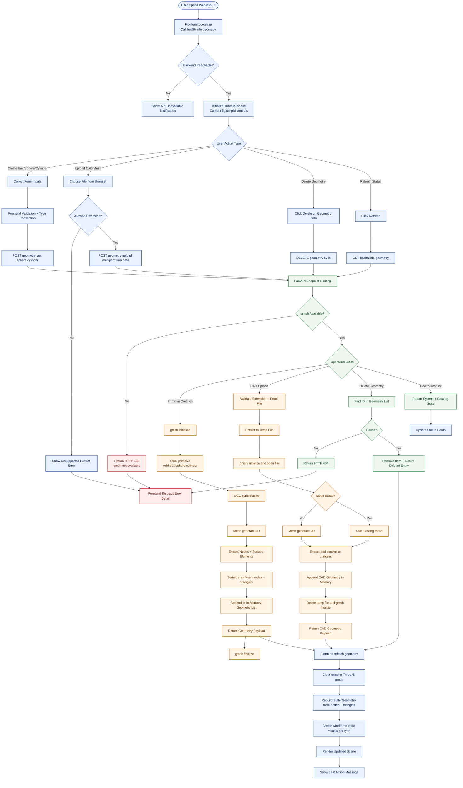
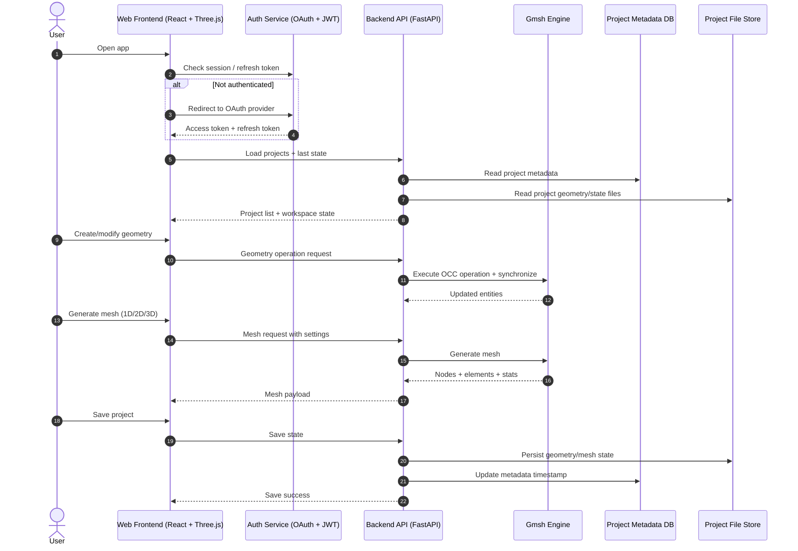
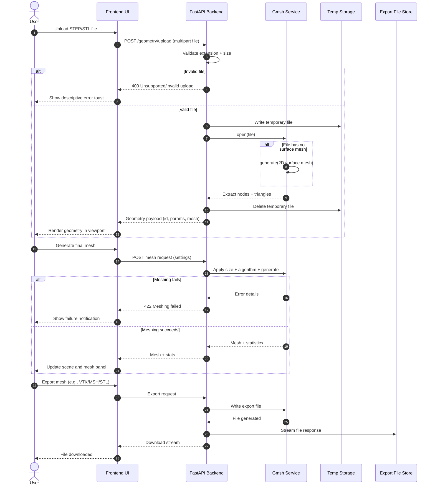
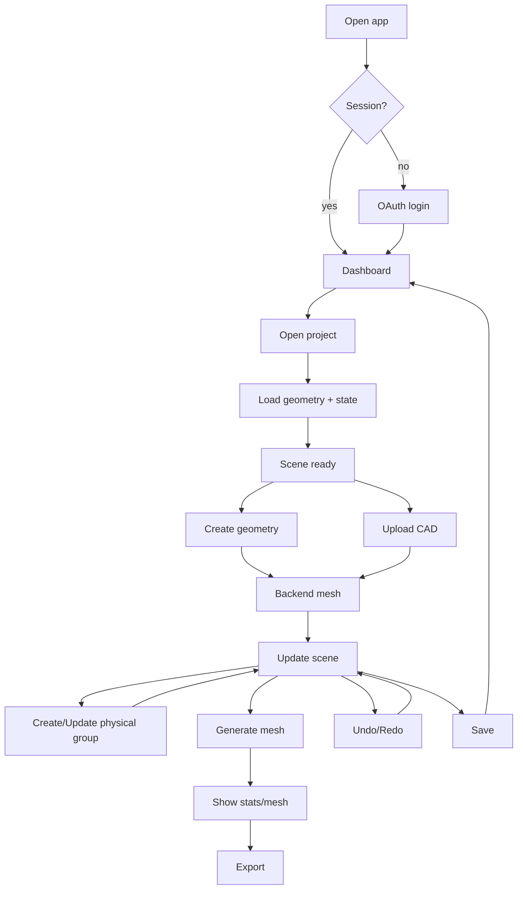
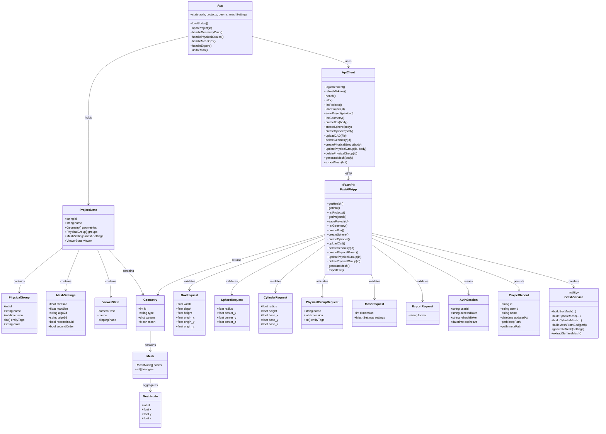
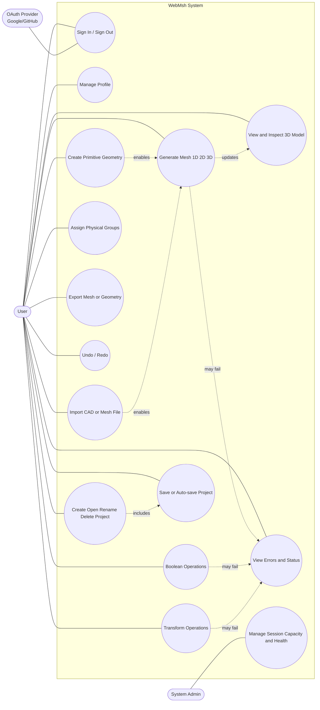
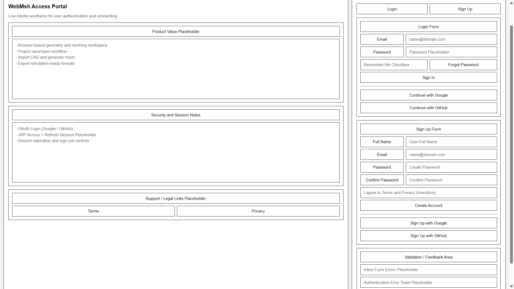
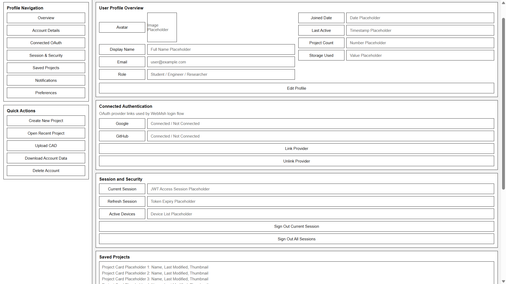
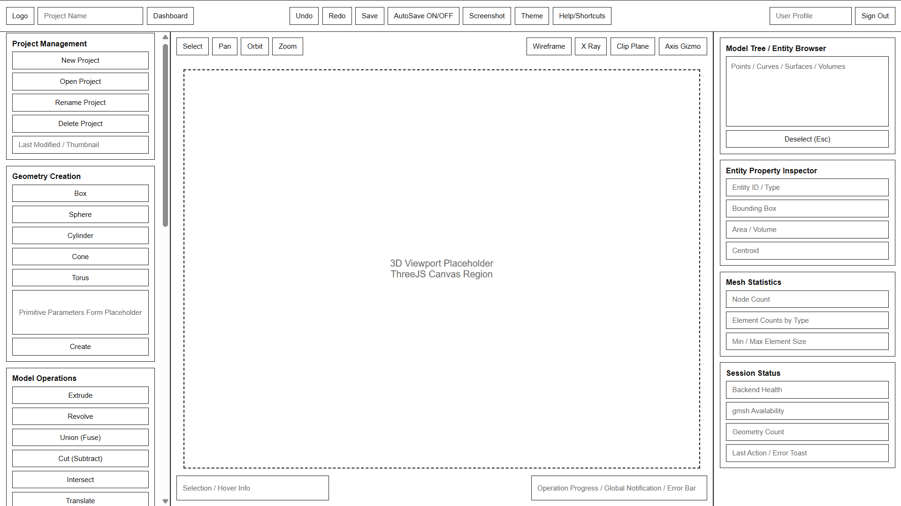

# Software Requirements Specification — WebMsh

 WebMsh — A Web-Based Mesh Generation Platform

---

## Table of Contents

1. [Product Overview](#1-product-overview)
   - 1.1 [Purpose](#11-purpose)
   - 1.2 [Intended Use and Target Audience](#12-intended-use-and-target-audience)
2. [Planning](#2-planning)
   - 2.1 [Product Initial Wish List](#22-product-initial-wish-list)
   - 2.2 [Sprint List](#23-sprint-list)
   - 2.3 [Tasks Per Sprint](#24-tasks-per-sprint)
3. [Workflows, UML Diagram and Wireframes](#4-workflows-UML-Diagrams-and-Wireframes)
   - 3.1 [Workflows](#41-workflow)
      - 3.1.1 [High-Level Design Workflow Diagram](#411-High-Level-Design-Workflow-diagram)
      - 3.1.2 [Operational Workflow Diagram](#412-operational-workflow-diagram)
   - 3.2 [UML Diagrams](#42-uml-diagrams)
      - 3.2.1 [Interaction Diagram](#421-interaction-Diagram)
      - 3.2.2 [Sequence Diagram](#422-sequence-Diagram)
      - 3.2.3 [Activity Diagram](#423-activity-Diagram)
      - 3.2.4 [Class Diagram](#424-class-Diagram)
      - 3.2.5 [Use Case Diagram](#425-use-case-Diagram)
   - 3.3 [Wireframes](#43-wireframes)
      - 3.3.1 [User Authenication Wireframe](#431-user-authenticaton-wireframe)
      - 3.3.2 [User Profile Wireframe](#432-user-profile-wireframe)
      - 3.3.3 [Main Application Wireframe](#433-main-application-wireframe)
4. [Features and Requirements](#3-features-and-requirements)
   - 4.2 [Functional Requirements](#32-functional-requirements)
   - 4.3 [External Interface Requirements](#33-external-interface-requirements)
   - 4.1 [Features](#31-features)
   - 4.4 [Non-Functional Requirements](#34-non-functional-requirements)
   - 4.5 [Assumptions and Dependencies](#35-assumptions-and-dependencies)
   - 4.6 [Languages and Tools Used](#36-languages-and-tools-used)
---

## 1. Product Overview
### 1.1 Purpose

This document specifies the software requirements for **WebMsh**, a web-based mesh generation platform built on top of the Gmsh Python API. It is intended to serve as the authoritative reference for the system's scope, features, constraints, and acceptance criteria throughout design, development, and testing.

WebMsh is a **server-side Gmsh instance with a web frontend**. The Python backend (FastAPI) runs the Gmsh API and exposes it via REST and WebSocket endpoints. The frontend (React + Three.js) provides a 3D viewer and interactive UI.
### 1.2 Intended Use and Target Audience

**Intended use:** WebMsh provides browser-based access to CAD geometry creation, manipulation, and finite element mesh generation — capabilities traditionally available only through desktop applications. Users interact with a 3D viewer and sidebar UI to build geometry, assign physical groups, generate meshes, and export results in standard simulation formats.

**Target audience:**

| # | Audience | Description |
|---|---|---|
| 1 | **Engineering students** | Learning FEA/CFD workflows; need accessible meshing without installing native software. |
| 2 | **Academic researchers** | Preparing meshes for simulation codes (FEniCS, OpenFOAM, Code_Aster, Elmer). |
| 3 | **Mechanical / Civil / Aerospace engineers** | Building and meshing simple-to-moderate geometry for structural or thermal analysis. |
| 4 | **CFD practitioners** | Generating surface and volume meshes for fluid simulation. |
| 5 | **3D printing users** | Creating or importing geometry and exporting watertight STL meshes. |

 
## 2. Planning

### 2.1 Product Initial Wish List

| # | Wish List Item |
|---|---|
| 1 | Access the full meshing workflow from any modern browser without installing software. |
| 2 | Create basic 3D geometry (boxes, spheres, cylinders) through a visual interface rather than code. |
| 3 | Combine and modify shapes using boolean operations like union, cut, and intersect. |
| 4 | View geometry and mesh output interactively in a 3D workspace with orbit, pan, and zoom controls. |
| 5 | Import existing CAD files (STEP, STL) and have them render in the workspace immediately. |
| 6 | Generate finite element meshes with control over element size and algorithm. |
| 7 | Export meshes in formats compatible with common simulation tools (FEniCS, OpenFOAM, Abaqus). |
| 8 | Define named regions on the geometry (physical groups) by clicking directly in the 3D viewer. |
| 9 | Save work and return to it later — projects should persist across sessions. |
| 10 | Undo mistakes without losing the full model state. |
| 11 | Sign in securely and know that only you can access your projects and files. |
| 12 | See meaningful feedback when something goes wrong — not silent failures. |
| 13 | A UI that doesn't feel overwhelming — clean, focused, and task-driven. |
| 14 | A platform that can grow — room to add more primitives, advanced meshing, and solver integration later. |

**Key User Stories:**

| # | Role | User Story | Acceptance Condition |
|---|---|---|---|
| 1 | Engineering student | I want to create a box and generate a mesh so I can export it for my FEA assignment without installing Gmsh locally. | Box created, meshed, and exported as `.msh` entirely in browser. |
| 2 | CFD researcher | I want to import a STEP file of my geometry and generate a volume mesh so I can run it in OpenFOAM. | STEP file imports, surface renders correctly, 3D mesh generated and exported as `.vtk`. |
| 3 | General user | I want to orbit, pan, and zoom around my model so I can inspect it before meshing. | Camera controls work smoothly; geometry visible from all angles. |
| 4 | General user | I want to undo the last operation so I can recover from a bad boolean cut without starting over. | Undo restores previous model state correctly. |
| 5 | General user | I want to define a boundary region by clicking faces in the viewer so I can assign inlet/outlet conditions for simulation. | Physical group created with selected faces highlighted in distinct color. |
| 6 | General user | I want my project to save automatically so I don't lose work if my browser crashes. | Session restored with full geometry and mesh state on reconnect. |
| 7 | General user | I want clear error messages when geometry or meshing fails so I know what to fix. | Descriptive toast notification shown; model state unchanged after failure. |
| 8 | System admin | I want user sessions to be authenticated and time-limited so that the server isn't exposed to unauthorized use. | JWT tokens expire after 1 hour; refresh token valid for 7 days; unauthenticated requests rejected. |

---

### 2.2 Sprint List

| Sprint | Title | Outcome |
|---|---|---|
| 1 | Project Setup and Core Architecture | A running two-part web system with frontend-backend communication confirmed, basic API routes live, and the development environment fully established. |
| 2 | Primitive Geometry Creation and Mesh Generation | End-to-end geometry creation working — users can create boxes, spheres, and cylinders via the API and receive valid mesh data back. |
| 3 | Frontend 3D Viewer and Interaction | A functional visual workspace where users interact with geometry through forms, see results in a Three.js viewport, and control the camera. |
| 4 | CAD/Mesh File Import and Geometry Management | File-based workflows added — users can upload STEP and STL files, view imported geometry, delete objects, and receive action feedback. |

---

### 2.3 Tasks Per Sprint

#### Sprint 1: Project Setup and Core Architecture — Total SP: 23

| # | Task | SP |
|---|---|---|
| 1 | Create the top-level repository structure for `frontend` and `backend`. | 1 |
| 2 | Initialize the frontend using Vite and React. | 2 |
| 3 | Initialize the backend using FastAPI and Uvicorn. | 2 |
| 4 | Add backend dependency definitions in `requirements.txt`. | 1 |
| 5 | Add frontend dependency definitions in `package.json`. | 1 |
| 6 | Configure ESLint for frontend code quality. | 2 |
| 7 | Configure Vite for frontend builds. | 1 |
| 8 | Create the backend application instance in `main.py`. | 1 |
| 9 | Add a root route for confirming API availability. | 1 |
| 10 | Add a health-check route for service monitoring. | 1 |
| 11 | Add an info route to expose app name, version, Gmsh availability, and geometry count. | 2 |
| 12 | Add CORS middleware for frontend-backend communication. | 2 |
| 13 | Verify local development connectivity between frontend and backend. | 3 |
| 14 | Define system scope, constraints, and initial feature requirements. | 3 |

#### Sprint 2: Primitive Geometry Creation and Mesh Generation — Total SP: 65

| # | Task | SP |
|---|---|---|
| 1 | Define `BoxRequest`, `SphereRequest`, and `CylinderRequest` models. | 3 |
| 2 | Define `MeshNode`, `Mesh`, and `Geometry` response models. | 3 |
| 3 | Implement `/geometry/box` endpoint. | 5 |
| 4 | Implement `/geometry/sphere` endpoint. | 5 |
| 5 | Implement `/geometry/cylinder` endpoint. | 5 |
| 6 | Add validation rules to ensure positive dimensions. | 2 |
| 7 | Integrate Gmsh initialization and cleanup inside each geometry workflow. | 5 |
| 8 | Implement `_build_box_mesh()` for box meshing. | 5 |
| 9 | Implement `_build_sphere_mesh()` for sphere meshing. | 5 |
| 10 | Implement `_build_cylinder_mesh()` for cylinder meshing. | 5 |
| 11 | Implement `_extract_surface_mesh()` to normalize mesh output. | 8 |
| 12 | Convert Gmsh node and element data into API-friendly JSON structures. | 5 |
| 13 | Store generated geometry in an in-memory list. | 2 |
| 14 | Implement `/geometry` GET endpoint to list all geometry objects. | 2 |
| 15 | Test that primitive creation returns valid node and triangle data. | 5 |

#### Sprint 3: Frontend 3D Viewer and Interaction — Total SP: 58

| # | Task | SP |
|---|---|---|
| 1 | Create the main React application component. | 2 |
| 2 | Initialize a Three.js scene on component mount. | 5 |
| 3 | Create perspective camera and WebGL renderer. | 3 |
| 4 | Add ambient and directional lighting. | 1 |
| 5 | Add grid helper and axes helper for scene orientation. | 1 |
| 6 | Add `OrbitControls` for user interaction. | 3 |
| 7 | Build animation/render loop. | 3 |
| 8 | Add responsive resize handling for the 3D canvas. | 2 |
| 9 | Create a geometry group container for rendered objects. | 2 |
| 10 | Build frontend logic to translate API mesh data into Three.js geometry. | 8 |
| 11 | Add wireframe/edge rendering for box geometry. | 3 |
| 12 | Add wireframe/edge rendering for sphere geometry. | 3 |
| 13 | Add wireframe/edge rendering for cylinder geometry. | 3 |
| 14 | Build forms for entering box dimensions and origin. | 3 |
| 15 | Build forms for entering sphere radius and center. | 3 |
| 16 | Build forms for entering cylinder dimensions and base position. | 3 |
| 17 | Connect form actions to backend API methods. | 5 |
| 18 | Load health, system info, and existing geometry on app startup. | 3 |
| 19 | Display backend status and geometry count in the sidebar. | 2 |
| 20 | Add sidebar collapse and expand behavior. | 3 |

#### Sprint 4: CAD/Mesh File Import and Geometry Management — Total SP: 56

| # | Task | SP |
|---|---|---|
| 1 | Implement `/geometry/upload` endpoint for multipart file upload. | 5 |
| 2 | Validate supported input file formats. | 2 |
| 3 | Store uploaded files in temporary backend storage. | 3 |
| 4 | Implement `_build_mesh_from_cad()` to open uploaded files through Gmsh. | 8 |
| 5 | Detect whether uploaded files already contain mesh data. | 5 |
| 6 | Generate a surface mesh if one is not already present. | 5 |
| 7 | Clean up temporary files after processing. | 2 |
| 8 | Return uploaded geometry as a normal geometry object with mesh data. | 3 |
| 9 | Add file input support in the frontend. | 2 |
| 10 | Add upload action button and wire it to the API. | 2 |
| 11 | Add API helper for file upload using `FormData`. | 2 |
| 12 | Render uploaded CAD/mesh results in the 3D scene. | 5 |
| 13 | Implement geometry deletion endpoint in the backend. | 2 |
| 14 | Implement delete action in the frontend API layer. | 2 |
| 15 | Add delete buttons for each geometry entry in the sidebar. | 2 |
| 16 | Refresh geometry state after create, upload, and delete operations. | 3 |
| 17 | Add user-facing action messages for success and failure cases. | 2 |

**Grand Total: 202 Story Points**

---

## 3. Workflows, UML Diagram and Wireframes
### 3.1 Workflows
#### 3.1.1 High-Level Design Workflow (Input -> Core -> Output)

```mermaid
flowchart LR
    %% =========================
    %% INPUT LAYER
    %% =========================
    subgraph IN[Input Layer]
        U1[User Geometry Parameters\nBox / Sphere / Cylinder]
        U2[User CAD/Mesh File Upload\nSTEP/STP/IGES/IGS/BREP/STL/VTK/MSH]
        U3[User Operation Commands\nCreate / Delete / Refresh / List]
    end

    %% =========================
    %% CORE LAYER
    %% =========================
    subgraph CORE[Core Processing Layer]
        FE[React UI + API Client\nVite Frontend]
        API[FastAPI REST Layer\nValidation + Routing + Error Handling]
        GMSH[gmsh Processing Engine\nOCC Geometry + Surface Meshing]
        MESH[Mesh Extraction Engine\nNodes + Triangles Serialization]
        MEM[In-Memory Geometry State\nSession-Local Geometry Catalog]
    end

    %% =========================
    %% OUTPUT LAYER
    %% =========================
    subgraph OUT[Output Layer]
        O1[3D Viewport Rendering\nThree.js Scene + Orbit Controls]
        O2[Geometry List + Status Cards\nHealth / gmsh / Geometry Count]
        O3[Operation Feedback\nSuccess / Error Action Messages]
    end

    %% FLOW
    IN --> FE
    FE --> API
    API --> GMSH
    GMSH --> MESH
    MESH --> MEM
    MEM --> API
    API --> FE
    FE --> OUT

    %% DESIGN STYLING
    classDef input fill:#E8F1FF,stroke:#1F4B99,stroke-width:1.4,color:#0E2A57;
    classDef core fill:#EEF8EE,stroke:#1B7F3A,stroke-width:1.4,color:#0F4F25;
    classDef out fill:#FFF3E8,stroke:#B86200,stroke-width:1.4,color:#6B3500;

    class U1,U2,U3 input;
    class FE,API,GMSH,MESH,MEM core;
    class O1,O2,O3 out;
```

---

#### 3.1.2 Detailed Workflow Diagram (Operational Flow)

---

### 3.2 UML Diagrams
#### 3.2.1 Interaction Diagram

---

#### 3.2.2 Sequence Diagram

---

#### 3.2.3 Activity Diagram

---

#### 3.2.4 Class Diagram

---

#### 3.2.5 Use Case Diagram

---

### 3.3 Wireframes
#### 3.3.1 User Authenication Wireframe

---
#### 3.3.2 User Profile Wireframe

---
### 3.3.3 Main Application Wireframe

---

## 4. Features and Requirements
### 4.1 Features
#### 4.1.1 Authentication and User Management

| # | Feature |
|---|---|
| 1 | OAuth sign-in via Google or GitHub. |
| 2 | JWT-based session tokens with expiration and refresh. |
| 3 | Sign-out and session invalidation. |
| 4 | User profile display (name, avatar from OAuth provider). |

#### 4.1.2 Project Management

| # | Feature |
|---|---|
| 1 | Create a new project with a name. |
| 2 | List all projects for the authenticated user (name, last modified date, thumbnail). |
| 3 | Open an existing project and restore its full geometry/mesh state. |
| 4 | Rename a project. |
| 5 | Delete a project. |
| 6 | Manual save via Ctrl+S or toolbar button. |

#### 4.1.3 Geometry Creation

| # | Feature | Gmsh API |
|---|---|---|
| 1 | Create a Box (origin, dx, dy, dz). | `occ.addBox()` |
| 2 | Create a Sphere (center, radius). | `occ.addSphere()` |
| 3 | Create a Cylinder (center, axis, radius, length). | `occ.addCylinder()` |
| 4 | Create a Cone (center, axis, r1, r2, length). | `occ.addCone()` |
| 5 | Create a Torus (center, r1, r2). | `occ.addTorus()` |
| 6 | Extrude a surface along a direction vector. | `occ.extrude()` |
| 7 | Revolve a surface around an axis by a specified angle. | `occ.revolve()` |

#### 4.1.4 Boolean Operations

| # | Feature | Gmsh API |
|---|---|---|
| 1 | Union (fuse) two or more volumes. | `occ.fuse()` |
| 2 | Cut (subtract) one volume from another. | `occ.cut()` |
| 3 | Intersect two or more volumes. | `occ.intersect()` |

#### 4.1.5 Geometry Transforms

| # | Feature | Gmsh API |
|---|---|---|
| 1 | Translate entities by a vector (dx, dy, dz). | `occ.translate()` |
| 2 | Rotate entities around an axis by an angle. | `occ.rotate()` |
| 3 | Scale entities from a center point by a factor. | `occ.dilate()` |
| 4 | Copy entities. | `occ.copy()` |
| 5 | Delete selected entities. | `occ.remove()` |

#### 4.1.6 Geometry Import

| # | Feature |
|---|---|
| 1 | Upload and import STEP files (.step, .stp) via file picker or drag-and-drop. |
| 2 | Upload and import STL files (.stl) via file picker or drag-and-drop. |

#### 4.1.7 Physical Groups

| # | Feature |
|---|---|
| 1 | Create a physical group for a given dimension (0D, 1D, 2D, 3D). |
| 2 | Assign a name to a physical group. |
| 3 | Add selected entities to a physical group via click-to-select in the 3D viewer. |
| 4 | Remove entities from a physical group. |
| 5 | Delete a physical group. |
| 6 | Color-code physical groups in the 3D viewer with distinct colors. |

#### 4.1.8 Export

| # | Feature | Format |
|---|---|---|
| 1 | Export mesh in Gmsh native format. | `.msh` |
| 2 | Export mesh as STL. | `.stl` |
| 3 | Export mesh in VTK format. | `.vtk` |
| 4 | Export geometry as STEP. | `.step` |
| 5 | Export mesh in Abaqus format. | `.inp` |
| 6 | Export mesh in Ideas/Universal format. | `.unv` |

#### 4.1.9 Workflow and UX

| # | Feature |
|---|---|
| 1 | Model tree / entity browser sidebar showing all entities organized by dimension. |
| 2 | Entity property inspector: clicking an entity displays its bounding box, area or volume, and centroid. |
| 3 | Undo and redo via Ctrl+Z / Ctrl+Y or toolbar buttons. |
| 4 | Loading indicators during mesh generation and geometry operations. |
| 5 | Error notifications (toast messages) for failed operations with descriptive messages. |
| 6 | Keyboard shortcuts: Delete (remove entity), Ctrl+Z (undo), Ctrl+Y (redo), Escape (deselect). |

### 4.2 Functional Requirements

#### 4.2.1 Authentication

| # | Requirement |
|---|---|
| 1 | The system shall redirect unauthenticated users to the sign-in page. |
| 2 | The system shall authenticate users via OAuth 2.0 Authorization Code flow with a supported provider (Google or GitHub). |
| 3 | Upon successful OAuth callback, the system shall issue a JWT access token (1-hour expiry) and a refresh token (7-day expiry). |
| 4 | The system shall reject API requests with expired or invalid JWT tokens with HTTP 401. |
| 5 | The system shall store user records (OAuth provider ID, display name, email, avatar URL) in the database upon first sign-in. |

#### 4.2.2 Gmsh Session Management

| # | Requirement |
|---|---|
| 1 | The system shall allocate one Gmsh process per active user session. |
| 2 | Each Gmsh process shall be isolated: operations in one session shall not affect another. |
| 3 | The system shall terminate idle Gmsh processes after 30 minutes of inactivity. |
| 4 | The system shall limit the maximum number of concurrent Gmsh sessions based on server configuration (default: 20). |
| 5 | If maximum sessions are reached, new session requests shall receive HTTP 503 with a "server at capacity" message. |

#### 4.2.3 Geometry Operations

| # | Requirement |
|---|---|
| 1 | The system shall support creation of geometry primitives and return updated model entities after each operation. |
| 2 | Boolean operations shall accept object and tool entities and return the resulting geometry. |
| 3 | If a geometry operation fails, the system shall return a descriptive error and leave the model state unchanged. |
| 4 | File import shall accept STEP and STL uploads (max 50 MB) and merge them into the current model. |

#### 4.2.4 Mesh Operations

| # | Requirement |
|---|---|
| 1 | Mesh generation shall support 1D, 2D, and 3D dimensions and apply configured mesh settings before generating. |
| 2 | Mesh statistics shall report node count, element count by type, and min/max element size. |
| 3 | Mesh export shall return the file as a downloadable stream in the selected format. |
| 4 | If mesh generation fails, the system shall return a descriptive error message. |

#### 4.2.5 Physical Groups

| # | Requirement |
|---|---|
| 1 | Physical groups shall be persisted as part of the project save state. |
| 2 | The system shall assign a unique color to each physical group automatically. Colors shall be distinct and visually differentiable (up to 12 groups; beyond 12, colors may repeat). |
| 3 | The system shall return entity-to-physical-group mappings so the frontend can apply per-face coloring. |

### 4.3 External Interface Requirements

#### 4.3.1 User Interface

| # | Requirement |
|---|---|
| 1 | The application shall present a single-page layout with: (a) a left sidebar for tools, forms, and the model tree; (b) a central 3D viewport; (c) a top toolbar for global actions (save, undo, redo, export, theme toggle). |
| 2 | The sidebar shall be collapsible to maximize viewport area. |
| 3 | Geometry creation forms shall validate input (e.g., radius > 0, dimensions > 0) and display inline validation errors before submission. |
| 4 | The 3D viewport shall occupy at least 60% of the screen width at all times. |
| 5 | The sign-in page shall display the application name, a brief description, and an OAuth sign-in button. |
| 6 | The project dashboard shall display projects as cards with name, last-modified timestamp, and a thumbnail preview. |

#### 4.3.2 Backend API

| # | Requirement |
|---|---|
| 1 | The backend shall expose a RESTful API over HTTPS on a configurable port (default: 8000). |
| 2 | All API endpoints (except `/auth/*`) shall require a valid JWT in the `Authorization: Bearer <token>` header. |
| 3 | The API shall return JSON for metadata responses and binary buffers for mesh/geometry data. |
| 4 | The API shall provide OpenAPI 3.0 documentation at `/docs` (auto-generated by FastAPI). |
| 5 | A WebSocket endpoint (`/ws/session/{session_id}`) shall be available for real-time progress updates during long-running operations (mesh generation). |

#### 4.3.3 External Systems

| # | Requirement |
|---|---|
| 1 | The system shall integrate with Google OAuth 2.0 or GitHub OAuth for user authentication. |
| 2 | The system shall use PostgreSQL (production) or SQLite (development) for persistent storage of user accounts and project metadata. |
| 3 | The system shall use the server filesystem for storing project geometry files (BREP) and exported meshes. |

### 4.4 Non-Functional Requirements

#### 4.4.1 Security

| # | Requirement |
|---|---|
| 1 | All client-server communication shall be encrypted via TLS (HTTPS / WSS). |
| 2 | JWT tokens shall be stored in HTTP-only, Secure, SameSite cookies — not localStorage. |
| 3 | File upload shall validate file extension and MIME type, and reject files exceeding the 50 MB size limit. |
| 4 | User-uploaded files shall be stored in sandboxed directories, isolated by user ID. A user shall not be able to access another user's files. |
| 5 | Server-side Gmsh processes shall not have network access or filesystem access beyond their designated project directory. |
| 6 | The API shall enforce rate limiting: maximum **100 requests per minute** per authenticated user. |

#### 4.4.2 Reliability

| # | Requirement |
|---|---|
| 1 | Auto-save shall ensure that no more than **30 seconds** of work is lost in the event of a server crash or browser close. |
| 2 | The system shall gracefully handle browser disconnection: the Gmsh session persists for 30 minutes, and the user can reconnect and resume. |

### 4.5 Assumptions and Dependencies

| # | Assumption / Dependency |
|---|---|
| 1 | **Gmsh Python package** (`pip install gmsh`) is available and functional on the deployment platform (Linux x86_64). |
| 2 | **Python 3.10+** is available on the server. |
| 3 | **OpenCASCADE** is bundled with the Gmsh package (this is the default for the PyPI distribution). |
| 4 | Users have a modern browser with **WebGL 2.0** support (Chrome 56+, Firefox 51+, Edge 79+, Safari 15+). |
| 5 | Users authenticate via a third-party OAuth provider (Google or GitHub). The OAuth provider's API is assumed to be available. |
| 6 | A **PostgreSQL** (or SQLite for development) database is available for user accounts and project metadata. |
| 7 | Server deployment infrastructure supports **Docker** and provides at least 2 GB RAM per concurrent user session. |
| 8 | Project geometry state can be reliably serialized to and deserialized from BREP format + JSON metadata. |

### 4.6 Languages and Tools Used

#### 4.6.1 Backend

| Tool / Language | Purpose |
|---|---|
| **Python 3.10+** | Primary backend language |
| **Uvicorn** | ASGI server hosting the FastAPI application |
| **FastAPI** | REST API framework, request routing, OpenAPI documentation |
| **Pydantic** | Request/response validation and schema definition |
| **Python-multipart** | Multipart form data parsing for file uploads |
| **Gmsh Python API** | Geometry creation, mesh generation, CAD operations |
| **OpenCASCADE** | CAD kernel bundled with Gmsh for geometry processing |

#### 4.6.2 Frontend

| Tool / Language | Purpose |
|---|---|
| **JavaScript / React** | Primary frontend language and UI framework |
| **Vite** | Build tool with fast HMR and JSX transformation |
| **Three.js** | WebGL 2.0 3D rendering and viewer |
| **CSS** | Layout, theming, and responsive design |
| **ESLint** | Code quality and linting |
| **TypeScript** | Type definitions for IDE support |

#### 4.6.3 Database

| Tool | Purpose |
|---|---|
| **PostgreSQL** | Production database for user accounts and project metadata |
| **SQLite** | Development database |

#### 4.6.4 Auth and Communication

| Tool | Purpose |
|---|---|
| **JWT** | Session token authentication |
| **Google OAuth 2.0 / GitHub OAuth** | Third-party user authentication |
| **WebSocket** | Real-time progress updates during long-running operations |

---

