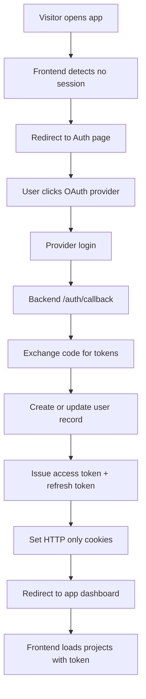

# Authentication Flow

```mermaid
flowchart TD
  A[Visitor opens app] --> B[Frontend detects no session]
  B --> C[Redirect to Auth page]
  C --> D[User clicks OAuth provider]
  D --> E[Provider login]
  E --> F[Backend /auth/callback]
  F --> G[Exchange code for tokens]
  G --> H[Create or update user record]
  H --> I[Issue access token + refresh token]
  I --> J[Set HTTP only cookies]
  J --> K[Redirect to app dashboard]
  K --> L[Frontend loads projects with token]
```
