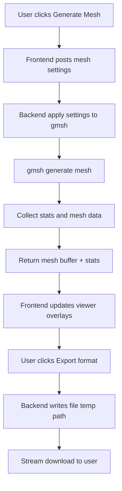

# Mesh Generation and Export Flow

```mermaid
flowchart TD
  A[User clicks Generate Mesh] --> B[Frontend posts mesh settings]
  B --> C[Backend apply settings to gmsh]
  C --> D[gmsh generate mesh]
  D --> E[Collect stats and mesh data]
  E --> F[Return mesh buffer + stats]
  F --> G[Frontend updates viewer overlays]
  G --> H[User clicks Export format]
  H --> I[Backend writes file temp path]
  I --> J[Stream download to user]
```
