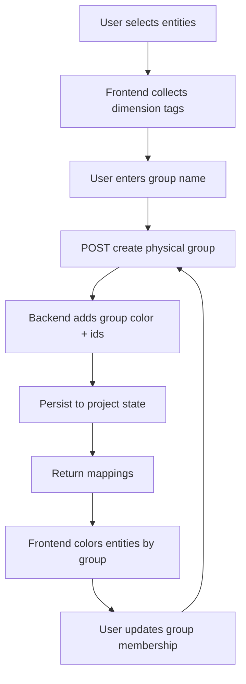

# Physical Groups Flow

```mermaid
flowchart TD
  A[User selects entities] --> B[Frontend collects dimension tags]
  B --> C[User enters group name]
  C --> D[POST create physical group]
  D --> E[Backend adds group color + ids]
  E --> F[Persist to project state]
  F --> G[Return mappings]
  G --> H[Frontend colors entities by group]
  H --> I[User updates group membership]
  I --> D
```
