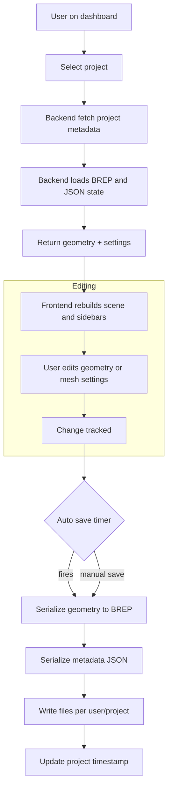

# Project Load and Save Flow

```mermaid
flowchart TD
  A[User on dashboard] --> B[Select project]
  B --> C[Backend fetch project metadata]
  C --> D[Backend loads BREP and JSON state]
  D --> E[Return geometry + settings]
  E --> F[Frontend rebuilds scene and sidebars]

  subgraph Editing
    F --> G[User edits geometry or mesh settings]
    G --> H[Change tracked]
  end

  H --> I{Auto save timer}
  I -- fires --> J[Serialize geometry to BREP]
  J --> K[Serialize metadata JSON]
  K --> L[Write files per user/project]
  L --> M[Update project timestamp]
  I -- manual save --> J
```
