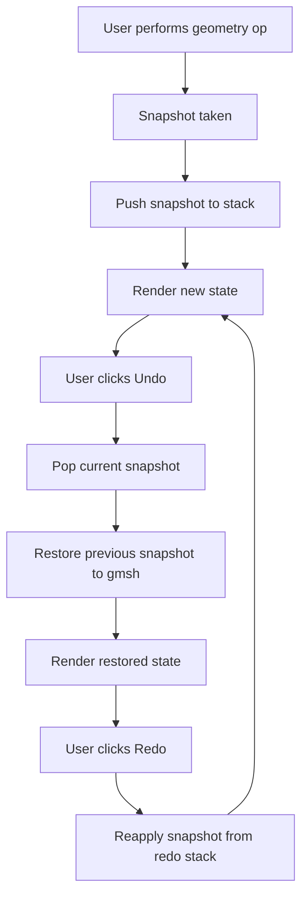

# Undo and Redo Flow

```mermaid
flowchart TD
  A[User performs geometry op] --> B[Snapshot taken]
  B --> C[Push snapshot to stack]
  C --> D[Render new state]
  D --> E[User clicks Undo]
  E --> F[Pop current snapshot]
  F --> G[Restore previous snapshot to gmsh]
  G --> H[Render restored state]
  H --> I[User clicks Redo]
  I --> J[Reapply snapshot from redo stack]
  J --> D
```
