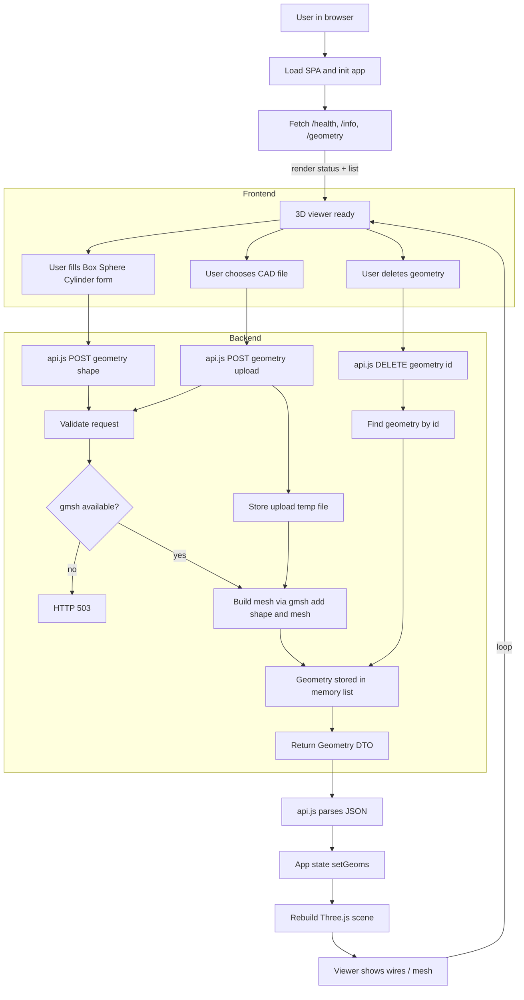

```mermaid
flowchart TD
  A[User in browser] --> B[Load SPA and init app]
  B --> C[Fetch /health, /info, /geometry]
  C -->|render status + list| D[3D viewer ready]

  subgraph Frontend
    D --> E[User fills Box Sphere Cylinder form]
    D --> F[User chooses CAD file]
    D --> G[User deletes geometry]
  end

  E --> H[api.js POST geometry shape]
  F --> I[api.js POST geometry upload]
  G --> J[api.js DELETE geometry id]

  subgraph Backend
    H --> K[Validate request]
    I --> K
    J --> L[Find geometry by id]
    K --> M{gmsh available?}
    M -- no --> X[HTTP 503]
    M -- yes --> N[Build mesh via gmsh add shape and mesh]
    I --> O[Store upload temp file]
    O --> N
    N --> P[Geometry stored in memory list]
    L --> P
    P --> Q[Return Geometry DTO]
  end

  Q --> R[api.js parses JSON]
  R --> S[App state setGeoms]
  S --> T[Rebuild Three.js scene]
  T --> U[Viewer shows wires / mesh]
  U -->|loop| D
```
